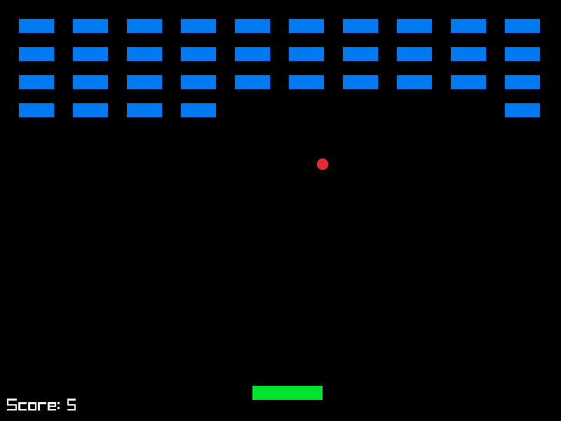

Minimalistic breakout clone. Expects [raylib](https://www.raylib.com) in the host system. Compiled with `zig 0.14.0-dev.1939+816dfca0b`.

```shell
zig build run
```



Big thanks to [cipharius](https://github.com/cipharius) for the code review!
